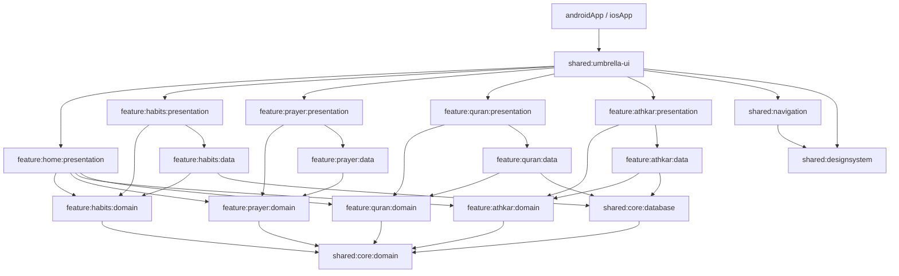

# Mudawama (مُداوَمَة)

**Mudawama** is a serene, offline-first, open-source Muslim habit tracker designed to help users build and maintain consistency in their daily spiritual obligations (Wird).

Built entirely with **Kotlin Multiplatform (KMP)** and **Compose Multiplatform (CMP)**, this project demonstrates modern, AI-driven mobile development using an enterprise-grade modular architecture.

> **Developers:** Please read the [Architecture & Module Structure Guide](docs/ARCHITECTURE.md) before exploring the codebase.

---

## Features (MVP)

* **Home Dashboard:** A single scrollable screen aggregating all features — Next Prayer hero card, Athkar daily status (Morning/Evening), Quran progress ring, Tasbeeh daily progress, and a Habits summary. Tap any card to navigate directly to that feature.
* **Prayer Tracking:** Log your 5 daily obligatory prayers with local times fetched via the Aladhan API.
* **Quran Tracking:** Set daily reading goals, log pages read, auto-advance your bookmark (Surah & Ayah) via the alquran.cloud API, view your reading streak, and browse recent daily logs with a 7-day date strip.
* **Athkar & Tasbeeh:** Tap-to-count checklists for Morning, Evening, and Post-Prayer remembrances (5 independent prayer slots), with daily completion persistence. Plus a digital Tasbeeh counter with haptic feedback, configurable goal, session/daily total tracking, and configurable daily reminder notifications.
* **Qibla Compass:** Real-time compass for finding prayer direction with native platform implementations (Compose for Android, SwiftUI for iOS), haptic feedback on alignment, calibration warnings, and location-based Qibla angle calculation using the Haversine formula.
* **Custom Habits:** Add personal spiritual goals (e.g., "Fasting Mondays", "Daily Sadaqah") with Boolean or Numeric (goal count) types.
* **Offline-First:** All your data stays on your device via Room SQLite. No account required. No ads. No tracking.

---

## UI & Design System

The entire application UI was designed using **Google Stitch** following a strict 8pt grid with a calm, premium aesthetic ("The Digital Sanctuary").

You can view the complete set of high-fidelity UI mockups in the [`docs/ui`](docs/ui/) directory:
* [Home Dashboard](docs/ui/home_dashboard.png)
* [Prayer Tracker](docs/ui/daily_prayer_tracker.png)
* [Quran Reading](docs/ui/quran_daily_reading_tracker.png)
* [Athkar & Tasbeeh](docs/ui/daily_athkar_tracker.png)
* ...and [more](docs/ui/).

---

## Project Documentation

This repository is thoroughly documented to simulate a complete product lifecycle. All foundational documents can be found in the [`docs/`](docs/) folder:

* **[Architecture Blueprint](docs/ARCHITECTURE.md):** Multi-Module "Dual-Umbrella" strategy, module dependency rules, navigation shell.
* **[System Design Document (SDD)](docs/SDD.md):** Data models, MVI flow, navigation shell, error handling.
* **[Product Requirements Document (PRD)](docs/PRD.md):** Scope, goals, and feature definitions.
* **[Software Requirements Spec (SRS)](docs/SRS.md):** Functional and non-functional requirements.
* **[User Stories](docs/USER_STORIES.md):** Agile use cases for the MVP.
* **[Design Guidelines](docs/DESIGN.md):** Global design system rules and theming constraints.

Feature specifications live in [`specs/`](specs/):
* [`specs/007-quran-tracking/`](specs/007-quran-tracking/) — Quran reading tracker
* [`specs/008-athkar-tasbeeh/`](specs/008-athkar-tasbeeh/) — Athkar & Tasbeeh counter
* [`specs/009-home-dashboard/`](specs/009-home-dashboard/) — Home Dashboard aggregator
* [`specs/010-settings-screen/`](specs/010-settings-screen/) — Settings screen with prayer calculation, location, theme, language, and notification preferences
* [`specs/011-qibla-compass/`](specs/011-qibla-compass/) — Qibla Compass with native iOS SwiftUI integration

---

## Tech Stack

* **Language:** Kotlin 2.3.20 (KMP — Android minSdk 30 + iOS 15+)
* **UI:** Compose Multiplatform 1.10.3 (Android & iOS)
  * **iOS Native UI:** Selected features (e.g., Qibla Compass) use native SwiftUI views via Swift-Kotlin interop for optimal performance
* **Architecture:** Clean Architecture + Custom MVI (Orbit-style) + strict module boundaries
* **Local Database:** Room 2.8.4 for KMP (SQLite, schema v4)
* **Settings Storage:** DataStore Preferences (prayer method, location, theme, language, notifications)
* **Networking:** Ktor 3.4.1 (Aladhan API for prayer times, alquran.cloud for bookmark resolution)
* **Dependency Injection:** Koin 4.2.0 (BOM + Platform Extensions)
  * **iOS Swift Integration:** Swift classes implement Kotlin interfaces and are injected via `initializeKoin()` (e.g., `IosLocationProvider`, `IosQiblaViewControllerProvider`)
* **Async / Date:** kotlinx-coroutines 1.10.2, kotlinx-datetime 0.7.1
* **Notifications:** Android AlarmManager + BroadcastReceiver; iOS UNCalendarNotificationTrigger
* **Sensors:** Android TYPE_ROTATION_VECTOR; iOS CLLocationManager (CoreLocation)
* **Tooling:** Gradle Convention Plugins (Configuration Cache ready) + GitHub Spec Kit

---

## Project Structure

The project follows a modular "Packaging by Feature" strategy.



**Bottom navigation:** 4 tabs — Home, Prayers, Quran, Athkar. Tasbeeh, Habits, Qibla, and Settings are push destinations (no bottom bar) accessible from the Home Dashboard.

---

## Getting Started

### Prerequisites
* Android Studio (Latest Stable or Preview)
* Xcode (for iOS development)
* JDK 17+

### Build & Run
1. Clone the repository:
   ```bash
   git clone https://github.com/Helmy2/mudawama.git
   ```
2. Open the project in Android Studio.
3. Sync the Gradle files.
4. **Android:** Select the `androidApp` run configuration and click Play.
5. **iOS:** Select the `iosApp` run configuration (ensure you have an iOS simulator selected) and click Play.
   *(Alternatively, open `iosApp/iosApp.xcodeproj` in Xcode and hit Run).*

---

## Contributing

Contributions are welcome! If you spot a bug or want to add a feature from the Phase 2 roadmap, please open an Issue first to discuss it before submitting a Pull Request.
